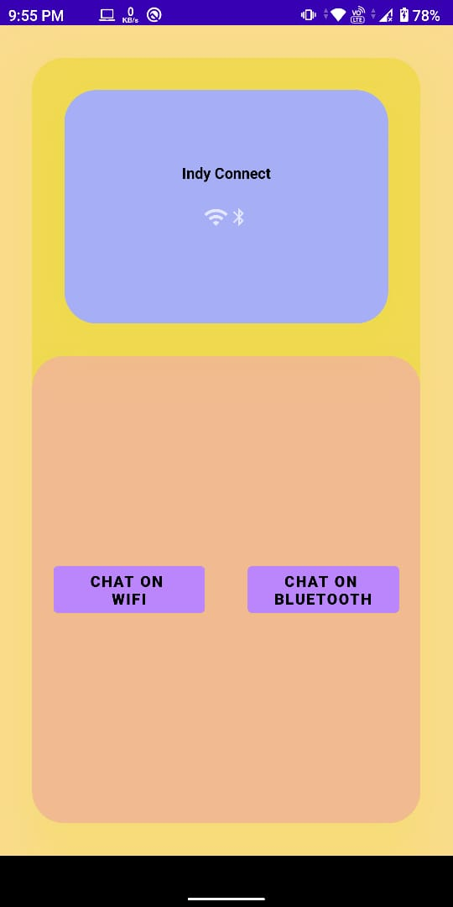
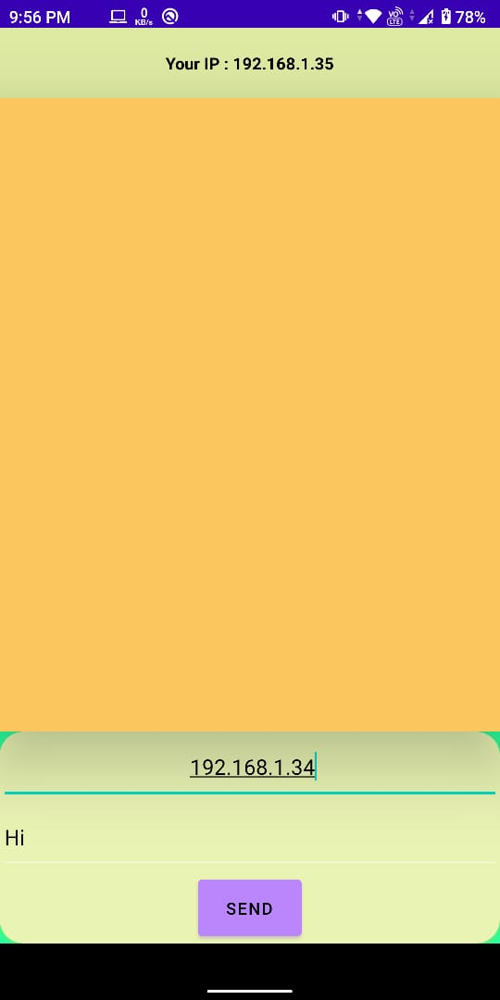
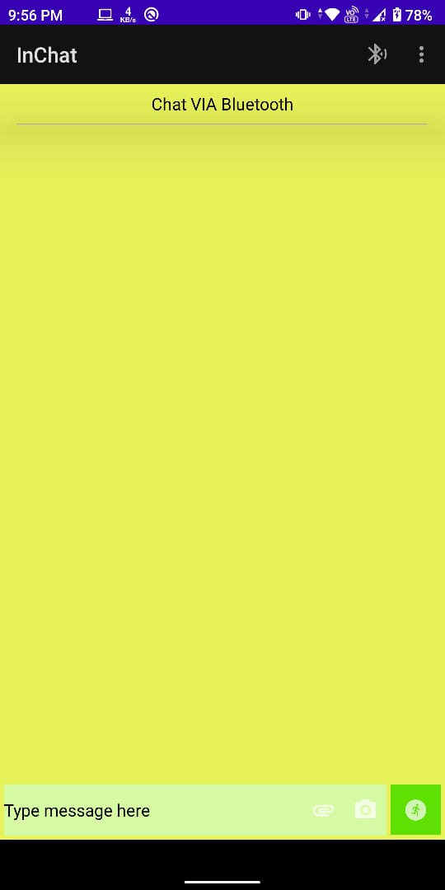
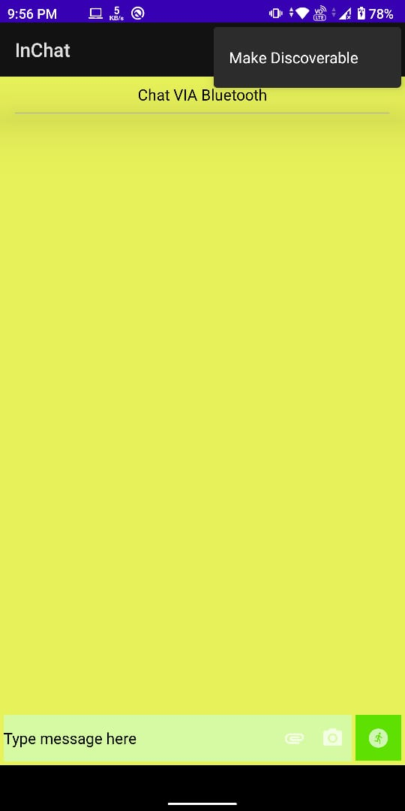

# InChat

An Offline Based chat application that enables users to Chat Using Bluetooth and Wifi Modules inbuilt in Android Device

## Advantages
> Can help you chat with your nearby even if no internet access is there

> Can be used in College campus where jammers restrict the usage of social media applications. Students face problems in sharing notes etc.

> Can be used in Corporate Offices where they might have jammers to restrict other websites during work time and can share thier work within Office Network

## How to Use

> **Step 1** Start the Application 

> **Step 2** Click  on WiFi button 

> **Step 3** Enter IP Address of the recipient along with your message 

> **Step 4** Return to your home activity 

> **Step 5** Click on Bluetooth button 

> **Step 6** Click on top bluetooth icon to search active devices 

> **Step 7** Select the device with whome you want to Chat  

> **Step 8** You can also make your device discoverable from top menu bar 
